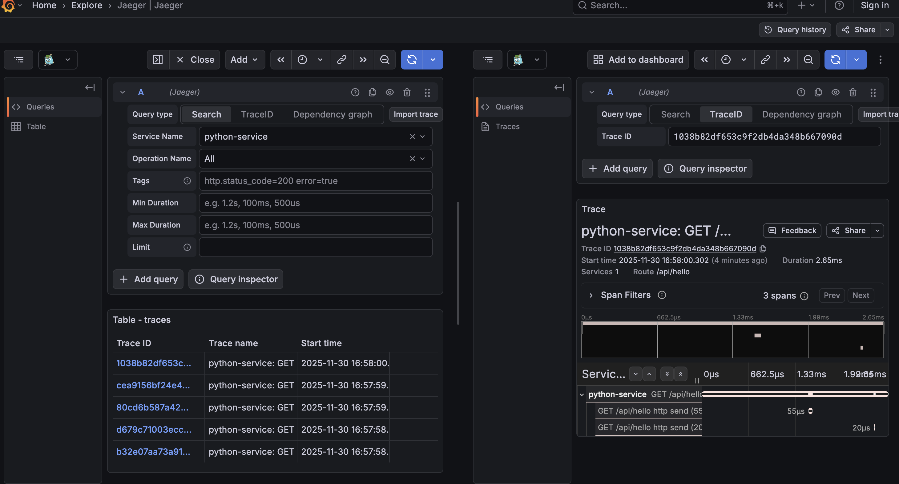
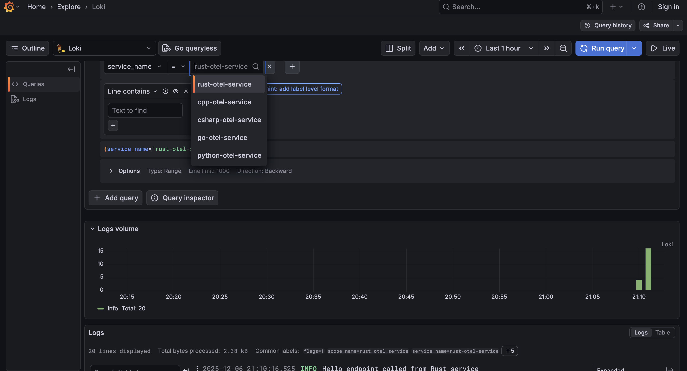

# OpenTelemetry Observability Stack PoC

Complete observability platform demonstrating traces, metrics and logs across C#, Go, Python, Rust and C++ using OpenTelemetry.

## Quick Start

### Docker Compose (Local Development)

```bash
# Start everything
make compose-start

# Or start specific services (Recommended)
make compose-infra
make compose-start SERVICES="python-otel-service go-otel-service csharp-otel-service rust-otel-service"
make compose-start SERVICES="cpp-otel-service" # NOTE: C++ service is resource- and time-consuming to build on first run. Use selective service startup to skip it initially.

# Generate test traffic and view results
make compose-test
make open-grafana  # Open http://localhost:3000 (admin/admin)

# Clean up docker resources
make compose-clean
```

### Kubernetes Kind (Local Development)

Open the matching [dev container](.devcontainer/kind/devcontainer.json) in any IDE that supports [dev containers](https://containers.dev/), then run:

```bash
# Terminal A - Deploy everything to Kind cluster
make k8s-deploy

# Terminal B - Port-forward everything (observability + services)
make k8s-fwd

# Terminal A - Generate test traffic and view results
make k8s-traffic
make open-grafana  # Open http://localhost:3000 (admin/admin)

# Clean up k8s resources
make k8s-clean
```

## What's Included

**Observability Stack:**
- **OpenTelemetry Collector** (port 4317) - Central telemetry hub
- **Jaeger** (port 16686) - Distributed tracing
- **Prometheus** (port 9090) - Metrics storage
- **Loki** (port 3100) - Log aggregation
- **Grafana** (port 3000) - Unified visualization

**Example Services:**
| Language | Port | Endpoint |
|----------|------|----------|
| C# (ASP.NET) | 5001 | http://localhost:5001/api/hello |
| Go (Gin) | 5002 | http://localhost:5002/api/hello |
| Python (FastAPI) | 5003 | http://localhost:5003/api/hello |
| Rust (Actix) | 5004 | http://localhost:5004/api/hello |
| C++ (httplib) | 5005 | http://localhost:5005/api/hello |

**Architecture:**
```
Services → OTLP (gRPC) → Collector → Jaeger/Prometheus/Loki → Grafana
```

**Why OpenTelemetry?**
- Vendor-neutral standard (CNCF)
- Single API across all languages
- Auto-instrumentation for common frameworks
- Future-proof observability
- Backend-agnostic (easily switch Jaeger/Tempo, Prometheus/Graphite, Loki/Elasticsearch)

## Viewing Telemetry

### 1. Traces (Jaeger)
```bash
make open-grafana
# Navigate to: Explore → Jaeger → Select service
```


### 2. Metrics (Prometheus)

```bash
# Request rate (Go, C# services)
otel_http_server_request_duration_seconds_count
rate(otel_http_server_request_duration_seconds_count[5m]) # per-second request rate based on the otel_http_server_request_duration_seconds_count counter, averaged over the last 5 minutes

# Response size (Go service)
otel_http_server_response_body_size_bytes_count
rate(otel_http_server_response_body_size_bytes_count[5m]) # per-second increase of the response body size counter over the last 5 minutes

# 95th percentile latency (Go service)
histogram_quantile(0.95, rate(otel_http_server_request_duration_seconds_bucket[5m])) # histogram_quantile(0.95, rate(otel_http_server_request_duration_seconds_bucket[5m])) calculates the 95th percentile request duration over the last 5 minutes

# Browse all HTTP metrics
{__name__=~"otel_http.*"}

# Note: Not all services export the same metrics due to varying auto-instrumentation support:
# - Go: ✅ Full HTTP metrics (Gin auto-instrumentation)
# - C#: Partial (client metrics only, server metrics missing)
# - Python: Different metric names (use response_size instead of duration)
# - Rust: ❌ No HTTP metrics (Actix has no auto-instrumentation)
# - C++: Manual counter only
# 
# TODO: Add manual HTTP metric instrumentation for Rust/C++ services.
# Refer to OpenTelemetry examples for your language:
# - Rust: https://github.com/open-telemetry/opentelemetry-rust/tree/main/examples
# - Python: https://opentelemetry.io/docs/languages/python/instrumentation/
# - C++: https://github.com/open-telemetry/opentelemetry-cpp/tree/main/examples
```

### 3. Logs (Loki)
```bash
# In Grafana Explore → Loki, try:
{service_name="rust-otel-service"}
{service_name=~".*-service"} |= "error"
```


## Development

**Dev Containers:**
Each service has a pre-configured [dev container](https://containers.dev/) with debugging support. Open the dev container in a supported IDE for the chosen service → run `make compose-infra` inside the container to launch external dependencies → set breakpoints in the service’s source code and start debugging

**Available Commands:**
```bash
Usage: make [target] [SERVICES="service1 service2"]

Common targets:
  open-grafana       Open Grafana in browser
  open-jaeger        Open Jaeger in browser
  open-prometheus    Open Prometheus in browser

Docker Compose targets:
  compose-start      Start services (use SERVICES="svc1 svc2" for specific)
  compose-stop       Stop services
  compose-restart    Restart services
  compose-logs       Show logs
  compose-build      Build service images
  compose-clean      Stop services and remove volumes
  compose-status     Show status of all services
  compose-test       Generate test traffic
  compose-infra      Start only infrastructure services

Kubernetes targets:
  k8s-deploy         Deploy all services to Kind cluster
  k8s-clean          Remove all deployments from Kind cluster
  k8s-fwd-obs        Port-forward observability stack only
  k8s-fwd-svc        Port-forward OpenTelemetry services only
  k8s-forward        Port-forward everything (observability + services)
  k8s-traffic        Generate test traffic to all services
```

## Troubleshooting

**No telemetry data?**
1. Check collector: `docker ps | grep otel-collector`
2. Generate traffic: `make test`
3. View logs: `docker logs otel-collector`

**Port conflicts?**
Edit left side of port mappings in `docker-compose.yml`

**Service issues?**
```bash
make logs SERVICES="service-name"
make compose-restart
```

## Resources

- [OpenTelemetry Docs](https://opentelemetry.io/docs/)
- [List of available OpenTelemetry Collector exporters](https://opentelemetry.io/docs/collector/components/exporter/)
- [Jaeger Docs](https://www.jaegertracing.io/docs/)
- [Prometheus Docs](https://prometheus.io/docs/)
- [Loki Docs](https://grafana.com/docs/loki/)
- [Grafana Docs](https://grafana.com/docs/)
- [OpenTelemetry Rust Examples](https://github.com/open-telemetry/opentelemetry-rust/tree/main/examples)
- [OpenTelemetry C++ Examples](https://github.com/open-telemetry/opentelemetry-cpp/tree/main/examples)
- [OpenTelemetry Go Examples](https://github.com/open-telemetry/opentelemetry-go-contrib/tree/main/examples)
- [OpenTelemetry NET Examples](https://github.com/open-telemetry/opentelemetry-dotnet/tree/main/examples)
- [OpenTelemetry Python Getting Started](https://opentelemetry.io/docs/languages/python/getting-started/)

## Common Use Cases

### Debugging a Slow Request
1. Find Jaeger traces by trace ID or time in Grafana or Jaeger dashboard
2. Identify slow span/operation
3. Check metrics for that service in Grafana
4. View logs from that timeframe in Loki
5. Fix and verify with new traces

### Performance Monitoring
1. Set up Grafana dashboard with key metrics
2. Track request rates, error rates, latencies
3. Set alerts on SLO violations
4. Correlate metrics with traces for investigation

## Production / Kubernetes Considerations

This PoC can be migrated to Kubernetes or deployed in the cloud:

- **Cloud/On-prem:** Deploy on managed/self-hosted Kubernetes; configure persistent storage, load balancers and ingress controllers or [Gateway API](https://kubernetes.io/docs/concepts/services-networking/gateway/).
- **Best practices:** Enable TLS, authentication/authorization, resource limits, sampling and backups for reliability.
